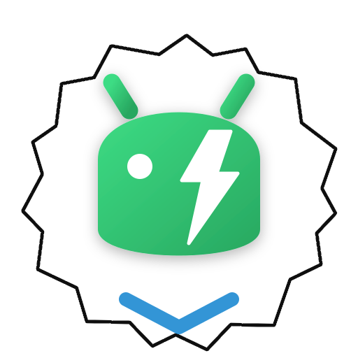

# Android Studio Flash

<div align="center">




**A lightweight VS Code extension that brings essential Android Studio features to your fingertips**

*Build, run, and debug Android apps without the heavy resource consumption of Android Studio. Features event-driven device monitoring for zero-impact on your system's RAM and CPU.*

</div>

---

## ✨ Features

### 🔨 Build System
- **One-click Build & Run** - Build and deploy your app with a single click
- **Debug APK** - Quick debug builds for development
- **Release APK** - Production-ready builds
- **Clean Project** - Remove build artifacts
- **Sync Gradle** - Synchronize project dependencies

### 📱 Device Management
- **⚡ Instant Device Detection** - Devices appear immediately when plugged in, with zero lag.
- **🍃 Zero-Resource Monitoring** - Uses event-driven ADB tracking instead of heavy polling loops, saving your CPU and RAM.
- **Device Selection** - Easy switching between multiple devices and emulators.
- **Real-time Status** - Live connection status (Online, Offline, Unauthorized).

### 📡 Wireless Debugging
- **Wireless Debugging (Android 11+)** - Connect without cables using pairing code
- **ADB over TCP/IP (Android 4.0+)** - Legacy wireless support
- **📶 Hotspot Mode Support** - Works when your Android device IS the hotspot (PC connects to phone's hotspot)
- **Auto-reconnect** - Automatically reconnects to saved devices on startup
- **Network Scanning** - Discover devices on your local network

### 📋 Logcat
- **Real-time Logs** - Live streaming with color-coded output
- **App Filter** - Show only your app's logs (like Android Studio)
- **Tag Filter** - Filter by specific log tags
- **Critical Highlighting** - Automatic highlighting of errors and exceptions

### 🛠️ Developer Tools
- **Android Control Panel** - Dedicated sidebar with all tools
- **Status Bar Integration** - Quick access from the status bar
- **Diagnostics Tool** - Troubleshoot connection issues

---

## 📦 Installation

### From VS Code Marketplace
1. Open VS Code
2. Go to Extensions (`Ctrl+Shift+X`)
3. Search for "Android Studio Flash"
4. Click **Install**

### From VSIX File
```bash
code --install-extension android-studio-flash-0.1.0.vsix
```

---

## 🚀 Quick Start

### Prerequisites
- **Android SDK** - Install via [Android Studio](https://developer.android.com/studio) or [Command-line tools](https://developer.android.com/studio#command-tools)
- **Java JDK** - Required for Gradle builds

### Setup
1. Open an Android project in VS Code
2. The extension activates automatically when it detects `build.gradle`
3. Click the **Android** icon in the Activity Bar
4. Connect a device or emulator
5. Click **▶️ Build & Run**

---

## 🎮 Commands

All commands are available via Command Palette (`Ctrl+Shift+P`):

| Command | Description |
|---------|-------------|
| `Android: Build APK` | Build debug APK |
| `Android: Build Release APK` | Build release APK |
| `Android: Run on Device` | Build and run on selected device |
| `Android: Clean Project` | Clean build artifacts |
| `Android: Sync Gradle` | Sync project with Gradle |
| `Android: Show Logcat` | Open Logcat output |
| `Android: Setup Wireless Connection` | Configure wireless debugging |
| `Android: Run Diagnostics` | Troubleshoot issues |

---

## ⚙️ Configuration

Configure the extension in VS Code Settings:

```json
{
  "android.sdkPath": "",              // Auto-detected if empty
  "android.adbPath": "",              // Auto-detected from SDK
  "android.logcat.maxLines": 1000,    // Max lines in Logcat
  "android.build.showNotifications": true
}
```

---

## 📡 Wireless Debugging Setup

### Android 11+ (Recommended)
1. Enable **Developer Options** on your device
2. Go to **Settings → Developer options → Wireless debugging**
3. Enable **Wireless debugging**
4. In VS Code, click **➕ Add Wireless Device**
5. Select **Wireless Debugging**
6. Enter the IP:Port and pairing code from your device

### Android 4.0+ (Legacy)
1. Connect device via USB
2. Click **➕ Add Wireless Device**
3. Select **ADB over TCP/IP**
4. Follow the prompts
5. Disconnect USB - you're now wireless!

---

## 🔧 Troubleshooting

### Device not detected?
Run **Android: Run Diagnostics** from the Command Palette to check:
- SDK installation
- ADB connectivity
- USB debugging status

### Common Issues

| Issue | Solution |
|-------|----------|
| "SDK not found" | Set `android.sdkPath` in settings or set `ANDROID_HOME` environment variable |
| "ADB not found" | Install Android SDK Platform-Tools |
| "Unauthorized" | Accept USB debugging prompt on device |
| "Wireless fails" | Ensure device and PC are on same network |

---

## 💡 Tips

- **Quick Run**: Click the status bar button to build & run instantly
- **Filter Logcat**: Use app filter to see only your app's logs
- **Save Wireless Devices**: Connected wireless devices are saved for auto-reconnect
- **Plug & Play**: No need to manually refresh devices! The extension listens to USB events and updates the device list instantly when a cable is connected or disconnected.

---

## 🤝 Contributing

Contributions are welcome! Please feel free to submit a Pull Request.

1. Fork the repository
2. Create your feature branch (`git checkout -b feature/AmazingFeature`)
3. Commit your changes (`git commit -m 'Add some AmazingFeature'`)
4. Push to the branch (`git push origin feature/AmazingFeature`)
5. Open a Pull Request

---

## 📄 License

This project is licensed under the MIT License - see the [LICENSE](LICENSE) file for details.

---

## 👨‍💻 Author

**Dr. Mohammed Hamed**

---

<div align="center">

**If you find this extension helpful, please consider giving it a ⭐ on GitHub!**

</div>
